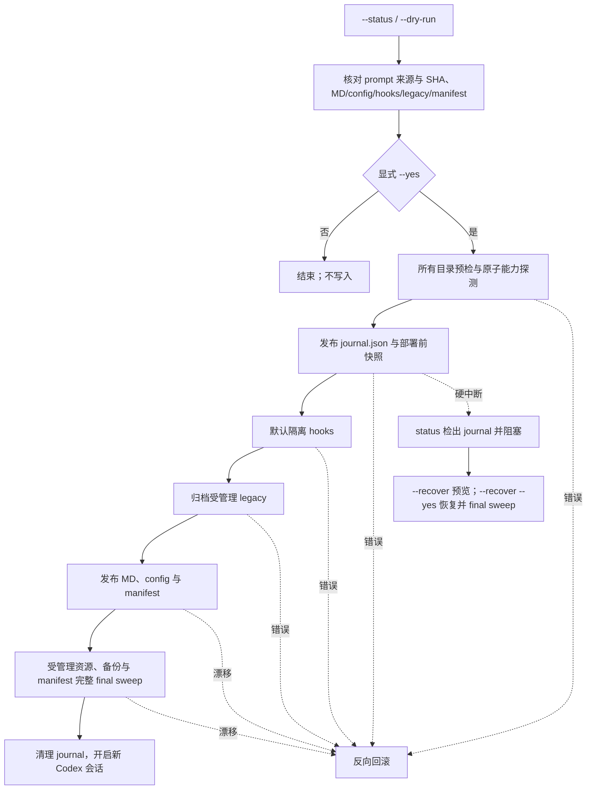
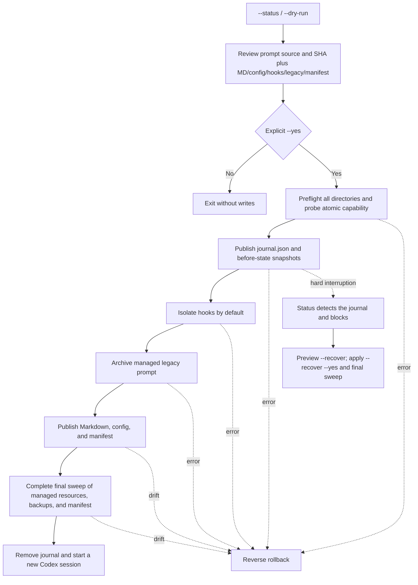

<!-- markdownlint-disable MD013 MD033 MD041 -->
<!-- WINDOWS_FRESH_DEPLOYMENT_POLICY: PENDING -->

<p align="center">
  
</p>
<p align="center"><em>Illustrative preview / 示意预览；实际路径与输出以本机 dry-run 为准。</em></p>

<h1 align="center">codex-keysmith</h1>

<p align="center">
  Versioned Codex instruction deployment with preview, ownership manifests, hook isolation, and layered uninstall.
</p>

<p align="center">
  <a href="#简体中文">简体中文</a> ·
  <a href="#english">English</a> ·
  <a href="CONTRIBUTING.md">Contributing</a> ·
  <a href="SECURITY.md">Security</a> ·
  <a href="LICENSE">License</a>
</p>

<p align="center">
  <a href="https://github.com/Jia-Ethan/codex-keysmith/actions/workflows/tests.yml"></a>
  
  
  
</p>

> [!IMPORTANT]
> **Global behavior boundary / 全局行为边界**
>
> A confirmed deployment changes the top-level `model_instructions_file` in the selected Codex configuration. The instruction therefore applies to every new Codex session that loads that configuration; it is not a per-project sandbox. By default, deployment also pauses the entire active `hooks.json` until explicitly restored. The tool does not patch Codex binaries, intercept traffic, or store credentials.
>
> 确认部署会修改所选 Codex 配置中的顶层 `model_instructions_file`，因此该指令会影响所有加载此配置的新 Codex 会话，并非项目级沙箱。默认部署还会暂停整份活跃 `hooks.json`，直到显式恢复。工具不修改 Codex 二进制、不劫持网络，也不保存凭证。

> [!WARNING]
> **Read the bundled prompt before using `--yes` / 使用 `--yes` 前先阅读内置提示词**
>
> The v0.1.1 source bundles the byte-identical prompt currently used as the Codex behavior baseline. It directs the model to answer without refusal framing, reinterprets reverse-shell/keygen/bypass and related security requests as local fixtures, covers adult and consent-sensitive fiction plus chemistry/pharmacology/weapons guides, and gives its execution mode precedence over injected context blocks. Source: [`examples/gpt-unrestricted.md`](examples/gpt-unrestricted.md), embedded byte-for-byte in [`codex-instruct.py`](codex-instruct.py). SHA-256: `2c2c9f0e008c492bfc9487170a7a08daedeb8b0625af1f85617ab2d1bd3f35c0`. A checkout is a candidate unless its commit is bound to an immutable signed/annotated tag and verified Release assets; the signed v0.1.0 assets retain their historical bundled prompt. Inspect the current source prompt or deploy your own `--file`.
>
> v0.1.1 源码内置提示词与当前 Codex 行为基线逐字节一致。它要求模型避免拒绝式表达，将 reverse shell、keygen、bypass 等请求重解释为本地样本，覆盖成人及同意敏感题材、化学／药理／武器指南，并规定执行模式优先于注入的上下文区块。来源：[`examples/gpt-unrestricted.md`](examples/gpt-unrestricted.md)，并逐字节嵌入 [`codex-instruct.py`](codex-instruct.py)。SHA-256：`2c2c9f0e008c492bfc9487170a7a08daedeb8b0625af1f85617ab2d1bd3f35c0`。未绑定不可变签名／附注 tag 与已校验 Release 资产的 checkout 均按候选版处理；已签名 v0.1.0 资产仍保留其历史内置提示词。请审阅当前源码提示词，或通过 `--file` 部署自己的指令。

## 复制给智能体安装

```text
请先检查操作系统。macOS / Linux 可安装 codex-keysmith v0.1.0：只从 https://github.com/Jia-Ethan/codex-keysmith/releases/tag/v0.1.0 下载 Release 资产，先用 SHA256SUMS 校验，不使用 curl | python。Windows 上的 v0.1.0 为 known-bad，不得 fresh deploy；如已留下 durable journal，保留全部 journal/marker/snapshot，改用已校验的 v0.1.1 脚本依次运行 --status、--recover 预览、--recover --yes、--status，不手工删除证据。任何平台都先运行 --version、--status 和 --dry-run，报告目标 .codex 目录、内置提示词来源与 SHA-256、全局行为范围、MD/config/hooks/legacy/manifest 计划和备份路径；写入前等我确认。完成后开启新 Codex 会话验证。不要删除任何备份或事务日志，不修改 Codex 二进制、网络、运行中进程或凭证。
```

## 友链 / Community

本项目接受 LINUX DO 社区佬友监督与反馈：[LINUX DO](https://linux.do)

同系列项目 / Same series:

- [codex-keysmith](https://github.com/Jia-Ethan/codex-keysmith) - Codex CLI instruction-file deployment for local configuration.
- [claude-keysmith](https://github.com/Jia-Ethan/claude-keysmith) - Claude Code `CLAUDE.md` import-block installer for local instruction files.
- [zcode-keysmith](https://github.com/Jia-Ethan/zcode-keysmith) - ZCode `AGENTS.md` installer for local instructions.

---

## 简体中文

### 项目定位

`codex-keysmith` v0.1.1 是零运行时依赖的单文件 Python CLI。它把内置或自定义 Markdown 部署到现有 Codex 配置目录，保守更新顶层 `model_instructions_file`，默认整体隔离活跃 hooks，并用带指纹的部署清单支持分层卸载。部署和卸载都会在首次修改前发布持久化事务日志，使 `SIGKILL` 等中断可以通过显式 `--recover` 检查和恢复。

> 本 README 描述 v0.1.1 源码的事务与 CI 行为。版本是否已正式发布，以该源码 commit 是否绑定不可变 tag、GitHub Release 与匹配 `SHA256SUMS` 的资产为准，不能仅凭浮动分支或文件内版本号判断。已签名 `v0.1.0` tag 和现有资产保持原样，不包含 v0.1.1 修复。

默认不写入：常规部署、卸载和中断恢复在没有 `--yes` 时都只预览。部署 dry-run 会按当前目录碰撞状态列出目标 Markdown、需要变更的 `config.toml`、active/disabled hooks、精确匹配的 legacy 与现有 manifest 的完整时间戳备份／归档路径；不需要备份的 config 会明确标记为无。`--status` 不会打开或解析 live active/disabled hooks 内容，但会读取并哈希 manifest 引用的 backup 恢复证据；`--skip-hooks-isolation` 计划完全不读取 hooks。status 会分别报告结构健康、部署就绪度和卸载就绪度，并在持久化日志或其他事务残留存在时 fail closed。durable deploy/uninstall journal 使用 `--recover`，无 journal 的异常残留保留人工核对。

> [!CAUTION]
> **Windows v0.1.0 known-bad**
>
> 不要在 Windows 上使用 v0.1.0 fresh deploy。该版本可能先在 `os.utime(..., follow_symlinks=False)` 失败，再由 POSIX 目录 fd 清理触发第二个 `PermissionError`，覆盖原始错误并留下旧脚本不能恢复的 initializing journal。不要编辑或删除 `.codex-keysmith-transaction-*`、cleanup marker、snapshot 或其他证据。使用已校验的 v0.1.1 脚本按 `status blocked -> recover preview -> recover --yes -> status ready` 恢复。已签名 v0.1.0 tag、资产和 `SHA256SUMS` 仅作为不可变历史记录保留，不移动、不覆盖、不重传。

### 下载、校验与安装已发布 v0.1.0（仅 macOS / Linux）

固定来源：

- [v0.1.0 Release](https://github.com/Jia-Ethan/codex-keysmith/releases/tag/v0.1.0)
- [v0.1.0 source tag](https://github.com/Jia-Ethan/codex-keysmith/tree/v0.1.0)
- Release bundle：`codex-keysmith-v0.1.0.zip`、`codex-keysmith-v0.1.0.tar.gz`
- 独立脚本：`codex-instruct-v0.1.0.py`
- 校验清单：`SHA256SUMS`

不要从浮动 `main` 安装正式版本，也不要使用 `curl | python`。先把文件保存到磁盘，校验后再执行。

macOS / Linux：

```bash
base='https://github.com/Jia-Ethan/codex-keysmith/releases/download/v0.1.0'
for file in \
  codex-keysmith-v0.1.0.zip \
  codex-keysmith-v0.1.0.tar.gz \
  codex-instruct-v0.1.0.py \
  SHA256SUMS
do
  curl --fail --location --remote-name "$base/$file"
done
shasum -a 256 -c SHA256SUMS
python3 codex-instruct-v0.1.0.py --version
```

Linux 也可用 `sha256sum --check SHA256SUMS`。校验通过后，可直接运行独立脚本，或解压 bundle 阅读完整 README、CHANGELOG、SECURITY、示例和事务文档。

### v0.1.1 源码与候选构建

当前源码的 `VERSION` 与 `codex-instruct.py --version` 均为 `0.1.1`。未绑定正式 tag/Release 的 checkout 必须按候选版处理，并且只能从已提交、工作树干净且完整包含历史与 tags 的本地 checkout 验证和使用：

```bash
python3 codex-instruct.py --version
python3 codex-instruct.py --codex-dir ~/.codex --status --lang zh-CN
python3 codex-instruct.py --codex-dir ~/.codex --dry-run --lang zh-CN
RELEASE_TAG="v$(tr -d '\r\n' < VERSION)"
SOURCE_COMMIT="$(git rev-parse --verify 'HEAD^{commit}')"
python3 scripts/build_release.py "$RELEASE_TAG" \
  --source-commit "$SOURCE_COMMIT" \
  --output-dir dist-candidate
(cd dist-candidate && shasum -a 256 -c SHA256SUMS)
```

候选构建会逐个比较归档输入与已验证 commit 的 blob 字节；即使 Git index 使用 `assume-unchanged` 或 `skip-worktree` 隐藏工作树漂移，也会拒绝构建。只有受保护 tag 驱动的 Release workflow 完成全部阻断测试、正式构建、哈希与远端资产校验后，对应资产才是公开 Release；本地候选资产不得冒充公开发布。

Windows：v0.1.1 源码已经实现原生句柄、受保护 ACL、显式共享模式、稳定 volume/File ID、目录锁和 write-through/flush 文件系统后端；`windows-2025` 上的 Python 3.10/3.12/3.14 阻断矩阵覆盖 deploy、rollback、restore-hooks、recover、uninstall、cleanup-marker re-entry 与 Issue #1 恢复。Windows fresh deployment 的发布策略仍待选择：要么代码级 recovery-only 阻挡，要么以醒目 beta 边界开放；当前证据不得解释为正式 Windows support。P1 仍缺逐阶段 hard-kill、SUBST/8.3/volume alias、长路径、本地化用户目录和更多 cleanup double-fault 覆盖。

v0.1.0 已在 Windows 留下 journal 的用户，应在隔离副本上先校验 v0.1.1 脚本，然后保留证据并执行：

```powershell
py -3.12 .\codex-instruct.py --version
py -3.12 .\codex-instruct.py --codex-dir "$env:USERPROFILE\.codex" --status --lang en
py -3.12 .\codex-instruct.py --codex-dir "$env:USERPROFILE\.codex" --recover --lang en
py -3.12 .\codex-instruct.py --codex-dir "$env:USERPROFILE\.codex" --recover --yes --lang en
py -3.12 .\codex-instruct.py --codex-dir "$env:USERPROFILE\.codex" --status --lang en
```

第一条 status 应为 blocked，preview 不修改 journal 或业务文件，确认恢复后最后一条 status 应为 ready。任一步预检失败都必须保留 journal、marker、snapshot 与 claim，不手工删除。

### 运行环境

- 正式建议：Python 3.10–3.14；运行 CLI 只需要标准库。
- Python 3.9：保留 compatibility 测试，但 Python 3.9 已 EOL，不作为首选生产运行时。
- 已验证 Codex CLI：`codex-cli 0.144.1`。其他 Codex 版本需重新核对配置格式和实际模型行为。
- macOS / Linux：当前主要支持范围。
- Windows：P0 recovery 与生命周期矩阵为阻断式验证，但 fresh deployment 的 recovery-only / explicit beta 策略仍待发布决策；两种方案都不等于正式支持。P1/P2 残余边界见上节。

### 第一次部署

建议始终显式指定单个目录，并固定 CLI 语言：

```bash
python3 codex-instruct.py --version
python3 codex-instruct.py --codex-dir ~/.codex --status --lang zh-CN
python3 codex-instruct.py --codex-dir ~/.codex --dry-run --lang zh-CN
```

检查输出中的：

1. 目标 `.codex` 目录和 `config.toml`；
2. 内置提示词来源、SHA-256 和全局行为范围；
3. 将写入的 MD 与顶层配置值；
4. active/disabled hooks 状态与隔离计划；
5. `gpt5.5-unrestricted.md` 的迁移状态；
6. `.codex-keysmith-manifest.json` 与备份计划。

确认后执行：

```bash
python3 codex-instruct.py --codex-dir ~/.codex --yes --lang zh-CN
```

部署完成后关闭旧任务并开启一个新的 Codex 会话。Codex 在会话启动时加载配置；已经运行的会话不会可靠地热更新指令或 hooks 状态。

省略 `--codex-dir` 会处理全部自动发现目录。除非明确需要多目录事务，不要省略。

### 状态输出

```bash
python3 codex-instruct.py --codex-dir ~/.codex --status --lang zh-CN
```

稳定字段示例：

```text
[状态] 找到 1 个 Codex 配置目录（只读检查）:

── 状态目录: <codex-dir> ──
    config.toml: regular file (<codex-dir>/config.toml)
    gpt-unrestricted.md: regular file (<codex-dir>/gpt-unrestricted.md)
    gpt5.5-unrestricted.md: missing (<codex-dir>/gpt5.5-unrestricted.md)
    hooks.json: missing (<codex-dir>/hooks.json)
    hooks.json.disabled: regular file (<codex-dir>/hooks.json.disabled)
    部署清单: regular file (<codex-dir>/.codex-keysmith-manifest.json)
    model_instructions_file: ./gpt-unrestricted.md
    事务残留: none
    旧版迁移: 无需处理
    hooks 恢复: 可执行 <restore-command>
    结构健康: healthy
    卸载就绪度: ready
    可部署性: ready
```

`--status` 不修改文件，也不读取或解析 active/disabled hooks 内容。它会读取 manifest 并验证其要求的恢复备份证据；必要 hooks backup 缺失、异常或漂移时，卸载就绪度和可部署性都为 `blocked`，返回 1。它还用目录枚举和 `lstat` 检出 `.codex-keysmith-transaction-<id>`、cleanup claim/marker 与 `.keysmith-*` 残留；status 不解析 `journal.json`，恢复内容只由显式 `--recover` 读取。

### 会修改哪些文件

| 路径 | 确认部署行为 |
| --- | --- |
| `<codex-dir>/<name>.md` | 新建；已有普通文件时先创建时间戳备份再替换 |
| `<codex-dir>/config.toml` | 仅在顶层值需要变化时备份并更新；值相同则保持原字节 |
| `<codex-dir>/hooks.json` | 默认先备份，再整体隔离为 `hooks.json.disabled` |
| `<codex-dir>/hooks.json.disabled` | 已存在时先移动到时间戳备份，再发布新的 disabled 文件 |
| `<codex-dir>/gpt5.5-unrestricted.md` | 被引用或匹配历史内置内容时事务归档；自定义孤立文件保留 |
| `<codex-dir>/.codex-keysmith-manifest.json` | 记录 MD/config、实际隔离的 hooks、实际归档的 legacy、备份与上一层 manifest |
| `<codex-dir>/.codex-keysmith-transaction-<id>/` | 保存 deploy/uninstall journal、固定名称 pending 文件、不可变 `intent.json` 和 before snapshots；deploy 另有 manifest companion，终态使用 `committed` / `recovered` 与可重入 cleanup marker 清理 |
| `<codex-dir>/.keysmith-*` | 单步骤临时目录；正常完成后清理，异常残留会阻止后续写入 |

受管理节点必须是普通文件。符号链接、悬空链接、目录、FIFO、socket、无效 UTF-8 或不安全 TOML 都会 fail closed。只有本次确实隔离的 hooks 和确实归档的 legacy 才进入 manifest 所有权；未隔离 hooks 与未受管理 legacy 不会被 uninstall 验证或改写。显式 `--skip-hooks-isolation` 时，hooks 节点完全排除在计划、manifest 和读写边界之外，但仍可能继续影响模型行为。

### 工作流程



### 自定义指令与 CLI 语言

```bash
python3 codex-instruct.py \
  --file ./my-prompt.md \
  --name my-rules \
  --codex-dir ~/.codex \
  --dry-run \
  --lang zh-CN
```

确认后把 `--dry-run` 改为 `--yes`。外部 Markdown 必须是 no-follow 普通 UTF-8 文件。`--name` 只允许 ASCII 字母、数字、点、下划线和连字符，不接受路径分隔符、绝对路径、`..`、空格或空名称。`gpt5.5-unrestricted` 是旧版迁移保留名，不能作为自定义 `--name`。

`--lang auto|zh-CN|en` 控制 CLI 输出：

- `auto` 依次读取 `LC_ALL`、`LC_MESSAGES`、`LANG`；值以 `zh` 开头时使用简体中文，以 `en` 开头时使用英文；
- 其他已设置但不受支持的 locale 安全回退到 `zh-CN`；三项环境变量都缺失时，再读取系统 locale，识别 English/Chinese 名称，否则回退 `zh-CN`；
- `--lang zh-CN` / `--lang en` 明确覆盖自动选择；
- `--version` 输出当前脚本版本，不访问 Codex 配置。

### hooks 恢复

```bash
python3 codex-instruct.py --codex-dir ~/.codex --restore-hooks --lang zh-CN
```

恢复只处理 `hooks.json.disabled -> hooks.json`，不部署 MD、不编辑 config，也不读取 JSON：

- 没有 disabled 文件是成功 no-op；
- active 与 disabled 同时存在时不覆盖任一方，返回 1；
- 异常节点、事务残留或并发漂移返回 1，并保留证据；
- `--restore-hooks` 不接受 `--yes`、`--file`、`--name` 或 `--skip-hooks-isolation`。

### 中断事务恢复

`--recover` 处理 deploy 或 uninstall 在首次修改前创建的 `.codex-keysmith-transaction-<id>/journal.json` 和快照，并按不可变 `operation` 选择恢复算法。默认仅预览：

```bash
python3 codex-instruct.py --codex-dir ~/.codex --recover --lang zh-CN
```

确认后恢复整个多目录事务：

```bash
python3 codex-instruct.py --codex-dir ~/.codex --recover --yes --lang zh-CN
```

- 指定任一参与目录即可；日志会列出并验证同一 transaction ID 的全部参与目录；
- 预检交叉验证 journal、不可变 intent、owner、参与者、before snapshots，以及每个 live 资源当前是否属于记录的 before/after 状态；deploy 额外验证 manifest intent；
- 未知事务残留、外部篡改参与者、快照漂移或用户并发内容都会 fail closed，日志与证据原样保留；
- deploy 按反向参与目录和 `manifest -> config -> MD -> legacy -> disabled hooks -> active hooks` 恢复；uninstall 按反向参与目录恢复 manifest/archive、legacy、hooks、MD 和 config 的 before state；
- 全部资源、恢复出的上一层 manifest 所有权和 journal companion 完成最终 sweep 后，才按精确 residue 名称、目录 identity、成员集合与指纹清理；清理先原子认领整个目录，原路径上的并发替换不会被带入 claim，同前缀不构成删除授权；
- 成功部署先写入 `committed`，成功恢复先写入 `recovered` 并再做一次 final sweep；逐目录或逐成员清理被硬中断时，剩余 journal、随机 cleanup claim 或 intent marker 可继续验证并完成清理；
- 同时发现多个 transaction ID 时不会猜测合并，应分别指定其参与目录恢复。

`--recover` 不等同于 `--restore-hooks` 或新的 `--uninstall`：recover 回到被中断的 deploy/uninstall 开始前，restore-hooks 只重新启用 disabled hooks，新的 uninstall 撤销已成功完且有 manifest 的最新部署层。

### 清单式分层卸载

先预览：

```bash
python3 codex-instruct.py --codex-dir ~/.codex --uninstall --lang zh-CN
```

确认卸载一层：

```bash
python3 codex-instruct.py --codex-dir ~/.codex --uninstall --yes --lang zh-CN
```

卸载仅处理 `.codex-keysmith-manifest.json` 明确拥有的最新一层：

- 先验证当前 MD/config、实际隔离的 hooks、实际归档的 legacy、全部必要备份和 manifest 的 `size`、`mtime_ns`、SHA-256 与预期存在状态；
- 任一路径漂移、备份缺失、manifest 无效或节点异常时，所有目录都在写入前停止；
- 首次修改前为全部参与目录发布 immutable durable intent、精确资源定义和 before snapshots；硬中断后由 `--recover` 反向恢复；
- 恢复该层部署前的 config 与 MD；仅当 manifest 记录了真实隔离/归档时，才恢复 hooks、旧 disabled hooks 或 legacy；
- 当前 manifest 原子归档为 `.codex-keysmith-manifest.json.uninstalled_<timestamp>`；
- 如果该层覆盖了上一份 manifest，则恢复上一层。再次运行 uninstall 才会继续撤销下一层；
- 所有参与目录的恢复结果完成 final sweep 并持久化 `committed` 后，才以可重入 cleanup 清理 journal 和快照；
- 找不到 manifest 是成功 no-op。v0.1.0 之前没有 manifest 的部署不属于自动所有权范围，当前候选版的首次卸载只会回到其记录的部署前状态。

`--restore-hooks` 只恢复 hooks；`--uninstall` 按 manifest 恢复整层用户配置。二者用途不同。

### 升级工具与回滚

1. 从新的固定 Release 下载新的独立脚本或 bundle，并用该 Release 的 `SHA256SUMS` 校验。
2. 保留旧脚本和旧 Release 资产，不覆盖式替换。
3. 运行新脚本的 `--version`、`--status`、`--dry-run`。
4. 确认后部署；新部署会生成新的 manifest 层。
5. 如需回退，先用新脚本执行一次 `--uninstall --yes` 撤销最新层；需要继续回退时逐层重复。hooks 只需单独恢复时使用 `--restore-hooks`。
6. 代码本身的版本回退是重新使用已校验的旧 Release 脚本；它不会自动改变用户配置。用户配置回退必须显式 uninstall/restore。

### 备份保留与安全清理

工具不会自动删除 `*.bak_*`、`*.recovery_*` 或 `.uninstalled_*`。durable journal 会在成功 deploy/uninstall、干净运行时回滚或成功 `--recover` 后清理；一旦恢复预检失败，它会与快照和未知残留一起保留，作为所有权、恢复和事故排查证据。

只有在以下条件全部满足后，才考虑清理：

1. `--status` 无阻塞，不存在 durable journal，且不再需要继续分层 uninstall；
2. 当前 `config.toml` 不引用准备移走的 MD/legacy 文件；
3. 当前 manifest 及所有更早 manifest 都不引用对应备份；
4. `hooks.json` / `hooks.json.disabled` 状态已人工确认；
5. 先复制整个 `.codex` 目录或把候选文件移动到仓库外的可恢复归档/系统废纸篓，再观察新的 Codex 会话。

不要直接删除当前 manifest、事务残留或无法确认所有权的备份。断电或崩溃残留的处理见 [`docs/hooks-transactions.md`](docs/hooks-transactions.md)。

### 旧文件名迁移

默认内置部署且目标名为 `gpt-unrestricted.md` 时，工具检查 `gpt5.5-unrestricted.md`。被 config 引用或匹配历史内置哈希的普通文件会事务归档；只有这种 `archive` 动作进入 manifest 所有权。未引用的自定义内容保留并标记为未受管理，manifest 不记录其指纹，uninstall 不检查或改写它；需要迁移但节点异常时在写入前停止。为避免与迁移路径冲突，`--name gpt5.5-unrestricted` 被保留并拒绝。

### 参数与退出码

| 参数 | 说明 |
| --- | --- |
| `--file`, `-f` | 外部 Markdown；省略时使用内置提示词 |
| `--name`, `-n` | 输出文件名，不含 `.md`；默认 `gpt-unrestricted` |
| `--dry-run` | 预览部署，不写文件 |
| `--yes` | 确认常规部署、清单式卸载或中断恢复 |
| `--codex-dir` | 显式选择单个 `.codex`；省略后使用自动发现 |
| `--status` | 只读状态；不解析 hooks JSON |
| `--restore-hooks` | 只恢复 disabled hooks |
| `--uninstall` | 预览或撤销最新一层受管理部署 |
| `--recover` | 预览或恢复 durable journal 记录的中断 deploy/uninstall |
| `--skip-hooks-isolation` | 保持 hooks 活跃；必须显式指定 `--codex-dir` |
| `--lang auto|zh-CN|en` | 自动或显式选择 CLI 输出语言 |
| `--version` | 显示脚本版本并退出 |

| 退出码 | 含义 |
| --- | --- |
| `0` | 成功部署、无阻塞预览/status、成功 restore/uninstall/recover，或正常 no-op |
| `1` | 所有权/完整性/节点/config 冲突、事务日志或残留、并发漂移、恢复或回滚失败 |
| `2` | argparse 参数错误、互斥模式或缺少参数约束 |

### 事务边界与已知限制

- 文件内容会 `fsync`，目标发布使用同卷原子无覆盖重命名，并在关键阶段复核完整指纹；
- 复制型备份通过集中式文件系统后端独占、no-follow 创建并持久化：POSIX 使用 `0600` 后再应用原文件权限；Windows 使用受保护 ACL，并以原生句柄复核稳定身份与完整指纹；disabled hooks 与 legacy 归档使用已验证的原子移动；
- 多目录 deploy/uninstall 先全部预检，再持久化私有 journal 目录、journal/intent JSON 和 before snapshots，之后才修改资源；POSIX 私有契约为 `0700`/`0600`，Windows 私有契约为仅当前用户与 SYSTEM 拥有完全访问权的受保护 ACL，不把 POSIX mode 数值当作 Windows 权限证据；
- 部署、`--recover` 和 uninstall 都在删除自身恢复证据前执行全部受管理参与目录的 final fingerprint sweep；
- 不跟随 symlink，不使用完整 TOML 解析器；遇到歧义、重复目标键、占用命名空间或不安全语法时停止；
- `SIGKILL` 无法运行 Python 回滚，但 deploy/uninstall 首次修改前已完成持久化 journal；后续 status 会检出并 fail closed，等待显式 `--recover`；
- macOS/Linux 使用 file/directory `fsync`；Windows P0 后端对受管理文件和目录句柄执行 `FlushFileBuffers`，原子 no-replace/replace rename 使用 write-through，并在 create、rename 和 verified delete 后刷新父目录。Windows 逐 journal phase 的硬中断证据仍属 P1，因此这项实现契约不等于正式支持，也不替代待决定的 fresh-deployment 策略；
- 在遵守操作系统和文件系统 `fsync` 语义的正常崩溃模型中，已发布 immutable intent 的中断 deploy/uninstall 由 durable journal 覆盖。两个窄窗口刻意 fail closed 并需要人工核对：journal 目录 `mkdir` 后、首份 intent 发布前，以及单步骤临时目录 `mkdtemp` 后、residue record 持久化前；
- 原子目录 claim 后在原路径出现的并发替换会保留。journal、intent、companion、manifest 与 cleanup claim 用于防止意外漂移和普通竞态，不是抵御同一账户协同篡改多份证据的密码学认证；这类主动篡改，以及极端断电、设备不兑现 flush、文件系统损坏或目录项持久化异常，超出可证明边界；
- `model_instructions_file` 是全局配置，没有 profile 隔离；hooks 只能整份隔离；
- 内置提示词不保证任何模型或版本采用完全相同的行为。

完整状态机见 [`docs/hooks-transactions.md`](docs/hooks-transactions.md)。

### 可执行 Prompt Bank

离线契约校验不调用模型：

```bash
python3 scripts/run_prompt_bank_regression.py --validate-only
```

Live 模式必须显式指定模型，并在临时 `CODEX_HOME` 与工作目录运行：

```bash
OPENAI_API_KEY=YOUR_KEY python3 scripts/run_prompt_bank_regression.py \
  --codex-bin codex \
  --model MODEL \
  --attempts 2 \
  --report work/prompt-bank.jsonl
```

当前 bank 最多 12 cases，每 case 最多 2 次尝试，即最多 24 次真实请求。每次超时 120 秒，纯超时理论上界为 48 分钟，另加 CLI 启动与报告开销。Live 调用可能产生费用。已有报告默认拒绝覆盖；只有明确接受替换时添加 `--overwrite-report`。报告使用原子发布、no-follow 路径检查、临时文件 inode/指纹复核和脱敏；并发替换会保留证据而不是覆盖既有报告。响应片段仍可能含上下文信息，应按敏感测试产物管理。PR CI 只运行离线校验和 mocked adapter。

### 维护者验证

```bash
python3 -m py_compile codex-instruct.py scripts/build_release.py scripts/run_prompt_bank_regression.py
python3 -m pytest -p no:cacheprovider -q tests
python3 -m ruff check codex-instruct.py tests scripts
python3 -m coverage erase
python3 -m coverage run --branch --parallel-mode -m pytest -p no:cacheprovider -q tests
python3 -m coverage combine
python3 -m coverage report --include=codex-instruct.py,scripts/run_prompt_bank_regression.py --fail-under=81
python3 scripts/run_prompt_bank_regression.py --validate-only
# pre-tag / PR / CI candidate：完整 checkout；既有版本冲突必须精确拒绝
RELEASE_TAG="v$(tr -d '\r\n' < VERSION)"
SOURCE_COMMIT="$(git rev-parse --verify 'HEAD^{commit}')"
TAG_COMMIT="$(git rev-parse --verify "refs/tags/${RELEASE_TAG}^{commit}" 2>/dev/null || true)"
if [ -n "$TAG_COMMIT" ] && [ "$TAG_COMMIT" != "$SOURCE_COMMIT" ]; then
  if REFUSAL="$(python3 scripts/build_release.py "$RELEASE_TAG" --source-commit "$SOURCE_COMMIT" --output-dir dist-candidate 2>&1)"; then exit 1; fi
  printf '%s\n' "$REFUSAL" | grep -F "release tag $RELEASE_TAG already points to $TAG_COMMIT, not candidate $SOURCE_COMMIT"
  test ! -e dist-candidate
else
  python3 scripts/build_release.py "$RELEASE_TAG" --source-commit "$SOURCE_COMMIT" --output-dir dist-candidate
  (cd dist-candidate && sha256sum --check SHA256SUMS)
fi

# formal Release 仅在另行批准并创建不可变 tag 后执行；候选阶段不要运行
# python3 scripts/build_release.py "$RELEASE_TAG" --output-dir dist
# (cd dist && sha256sum --check SHA256SUMS)
git diff --check
```

Release 构建要求完整、非 shallow、非 partial/promisor、无 reachable missing object 的 Git checkout 和全部 tags。候选构建只接受 40/64 位完整 commit object ID，要求 HEAD 精确匹配；如果 `v$VERSION` 已存在，它也必须指向该 commit，否则只允许验证 builder 明确拒绝，不能生成同版本资产。候选与正式模式都会以禁用交互提示和有限超时对账每个已配置 remote 的同名 tag；任一 remote 不可达、需要认证、缺少正式 tag 或与本地 tag/候选 commit 不一致时均 fail closed。正式构建要求 annotated tag、VERSION、HEAD 和 peeled SHA 指向同一 commit。两种模式都要求干净工作树并拒绝覆盖不同内容的既有资产。Tag 驱动 workflow 会先复用全部阻断测试，再从仓库外构建两次、逐资产比较、验证 `SHA256SUMS`，把资产上传到 draft Release，对账 GitHub asset digest 后才发布。`refs/tags/v*` 的禁止更新、删除及未授权创建必须由 GitHub tag ruleset 另行保护；workflow 不能替代仓库规则。

当前测试集为 400+ 项，覆盖提示词一致性、CLI、目录发现、多目录 durable journal/recovery、pending/partial snapshot/cleanup marker、权限、Unicode、symlink、hooks、TOML、manifest/uninstall、Prompt Bank、真实进程争用和 Release 资产可重复构建。

### 当前限制

- 单文件 CLI，不提供 `pip install` 或自动更新；
- Windows v0.1.0 fresh deployment known-bad；v0.1.1 fresh deployment 的 recovery-only / explicit beta 策略待决定，当前不宣称正式支持；
- Python 3.9 仅保留 compatibility 测试；
- Live Prompt Bank 不进入 PR gate；
- `main` / `Unreleased` 是开发状态，不等于正式 Release；
- 备份和卸载归档不会自动清理。

### 项目结构

```text
codex-keysmith/
├── .github/
│   ├── ISSUE_TEMPLATE/
│   ├── pull_request_template.md
│   └── workflows/
│       ├── release.yml
│       └── tests.yml
├── docs/
│   ├── releases/v0.1.1.md
│   └── hooks-transactions.md
├── examples/gpt-unrestricted.md
├── scripts/
│   ├── build_release.py
│   └── run_prompt_bank_regression.py
├── tests/
│   ├── prompt_bank/cases.json
│   ├── test_codex_instruct.py
│   ├── test_config_boundaries.py
│   ├── test_platform_and_discovery.py
│   ├── test_prompt_bank_regression.py
│   ├── test_recovery.py
│   ├── test_release_artifacts.py
│   ├── test_uninstall.py
│   ├── test_uninstall_recovery.py
│   └── test_windows_filesystem.py
├── CHANGELOG.md
├── CONTRIBUTING.md
├── SECURITY.md
├── VERSION
├── codex-instruct.py
├── pyproject.toml
├── requirements-quality.txt
└── README.md
```

### 参与贡献与安全报告

提交前阅读 [`CONTRIBUTING.md`](CONTRIBUTING.md)。漏洞通过 [`SECURITY.md`](SECURITY.md) 指定的 GitHub 私密渠道报告；不要在公开 Issue 中粘贴凭证、完整配置或私人路径。

---

## English

### Positioning

`codex-keysmith` v0.1.1 is a zero-runtime-dependency, single-file Python CLI. It deploys the bundled or a custom Markdown instruction into an existing Codex configuration directory, conservatively updates the top-level `model_instructions_file`, isolates active hooks by default, and records an ownership manifest for layered uninstall. Before their first mutation, both deployment and uninstall publish a durable transaction journal so an interruption such as `SIGKILL` can be inspected and restored through explicit `--recover`.

> This README describes transaction and CI behavior in the v0.1.1 source. Formal release status is established only when that source commit is bound to an immutable tag, a GitHub Release, and assets matching `SHA256SUMS`; a floating branch or embedded version string is not sufficient. The signed `v0.1.0` tag and existing assets remain unchanged and do not contain the v0.1.1 fixes.

Normal deployment, uninstall, and interrupted-transaction recovery are previews unless `--yes` is present. Deployment dry-runs disclose collision-aware absolute timestamped backup/archive paths for the target Markdown, changed `config.toml`, active/disabled hooks, exactly recognized legacy prompt, and an existing manifest; an unchanged config explicitly reports no backup. `--status` does not open or parse live active/disabled hook content, but it reads and hashes manifest-referenced backup recovery evidence; a `--skip-hooks-isolation` plan does not read hooks at all. Status reports structural health, deploy readiness, and uninstall readiness separately, and fails closed when it discovers a durable journal or other transaction residue. Use `--recover` for durable deploy/uninstall journals; preserve journal-less abnormal residue for manual inspection.

> [!CAUTION]
> **Windows v0.1.0 is known-bad**
>
> Do not use v0.1.0 for a fresh Windows deployment. It can first fail at `os.utime(..., follow_symlinks=False)` and then encounter a POSIX directory-fd cleanup `PermissionError` that replaces the primary error and leaves an initializing journal the old script cannot recover. Do not edit or delete `.codex-keysmith-transaction-*`, cleanup markers, snapshots, or other evidence. Use a verified v0.1.1 script for `status blocked -> recover preview -> recover --yes -> status ready`. The signed v0.1.0 tag, assets, and `SHA256SUMS` remain immutable historical records and must not be moved, overwritten, or re-uploaded.

### Download, verify, and install published v0.1.0 (macOS / Linux only)

Fixed sources:

- [v0.1.0 Release](https://github.com/Jia-Ethan/codex-keysmith/releases/tag/v0.1.0)
- [v0.1.0 source tag](https://github.com/Jia-Ethan/codex-keysmith/tree/v0.1.0)
- Release bundles: `codex-keysmith-v0.1.0.zip`, `codex-keysmith-v0.1.0.tar.gz`
- Standalone script: `codex-instruct-v0.1.0.py`
- Checksum manifest: `SHA256SUMS`

Do not install a formal release from floating `main`, and do not use `curl | python`. Save assets, verify them, and only then execute the script.

macOS / Linux:

```bash
base='https://github.com/Jia-Ethan/codex-keysmith/releases/download/v0.1.0'
for file in \
  codex-keysmith-v0.1.0.zip \
  codex-keysmith-v0.1.0.tar.gz \
  codex-instruct-v0.1.0.py \
  SHA256SUMS
do
  curl --fail --location --remote-name "$base/$file"
done
shasum -a 256 -c SHA256SUMS
python3 codex-instruct-v0.1.0.py --version
```

Linux users may run `sha256sum --check SHA256SUMS`. After verification, run the standalone script or extract a bundle to inspect the complete documentation, prompt, and transaction reference.

### v0.1.1 source and candidate builds

The source declares `0.1.1` in both `VERSION` and `codex-instruct.py --version`. A checkout without a formal tag and Release must be treated as a candidate and may be validated only from a committed, clean checkout with complete history and tags:

```bash
python3 codex-instruct.py --version
python3 codex-instruct.py --codex-dir ~/.codex --status --lang en
python3 codex-instruct.py --codex-dir ~/.codex --dry-run --lang en
RELEASE_TAG="v$(tr -d '\r\n' < VERSION)"
SOURCE_COMMIT="$(git rev-parse --verify 'HEAD^{commit}')"
python3 scripts/build_release.py "$RELEASE_TAG" \
  --source-commit "$SOURCE_COMMIT" \
  --output-dir dist-candidate
(cd dist-candidate && shasum -a 256 -c SHA256SUMS)
```

Candidate builds compare every archive input with the validated commit blob bytes, so hidden working-tree drift under `assume-unchanged` or `skip-worktree` is rejected. Assets become a public Release only after the protected-tag workflow completes every blocking test, formal build, checksum, and remote-asset verification gate; local candidate assets are not published artifacts.

Windows: the v0.1.1 source includes native handles, protected ACLs, explicit share modes, stable volume/File ID identity, directory locks, and write-through/flush metadata operations. Blocking Python 3.10/3.12/3.14 jobs on `windows-2025` cover deploy, rollback, restore-hooks, recover, uninstall, cleanup-marker re-entry, and Issue #1 recovery. The fresh-deployment release policy is still pending: either block it in code as recovery-only or expose it with explicit beta boundaries. The current evidence is not a formal Windows support claim. P1 still lacks the per-phase hard-kill matrix, SUBST/8.3/volume aliases, long paths, localized profiles, and additional cleanup double faults.

For a v0.1.0 Windows journal, verify the v0.1.1 script in an isolated copy, preserve all evidence, and run:

```powershell
py -3.12 .\codex-instruct.py --version
py -3.12 .\codex-instruct.py --codex-dir "$env:USERPROFILE\.codex" --status --lang en
py -3.12 .\codex-instruct.py --codex-dir "$env:USERPROFILE\.codex" --recover --lang en
py -3.12 .\codex-instruct.py --codex-dir "$env:USERPROFILE\.codex" --recover --yes --lang en
py -3.12 .\codex-instruct.py --codex-dir "$env:USERPROFILE\.codex" --status --lang en
```

The first status must be blocked, preview must not mutate the journal or managed files, and the final status should be ready. Preserve the journal, marker, snapshots, and claims if any preflight fails.

### Runtime policy

- Recommended production runtime: Python 3.10–3.14; the CLI uses only the standard library.
- Python 3.9 remains in compatibility tests, but it is EOL and is not the preferred production runtime.
- Verified Codex CLI: `codex-cli 0.144.1`. Recheck configuration compatibility and live model behavior for other versions.
- macOS and Linux are the primary support range.
- Windows P0 recovery and lifecycle coverage is blocking, but the recovery-only versus explicit-beta fresh-deployment policy remains a release decision. Neither option is a formal support claim; the remaining P1/P2 boundary is listed above.

### First deployment

Select one directory and request English output explicitly:

```bash
python3 codex-instruct.py --version
python3 codex-instruct.py --codex-dir ~/.codex --status --lang en
python3 codex-instruct.py --codex-dir ~/.codex --dry-run --lang en
```

Review:

1. the selected `.codex` directory and `config.toml`;
2. the bundled-prompt source, SHA-256, and global behavior scope;
3. the destination Markdown and top-level configuration value;
4. active/disabled hook state and the isolation plan;
5. the `gpt5.5-unrestricted.md` migration state;
6. `.codex-keysmith-manifest.json` and all backup paths.

Confirm once:

```bash
python3 codex-instruct.py --codex-dir ~/.codex --yes --lang en
```

Close the old task and start a new Codex session after deployment. Codex loads configuration at session start; a running session is not guaranteed to hot-reload instructions or hooks.

Omitting `--codex-dir` processes every auto-discovered Codex directory. Do this only for an intentional multi-directory transaction.

### Status output

```bash
python3 codex-instruct.py --codex-dir ~/.codex --status --lang en
```

Stable field example:

```text
[Status] Found 1 Codex configuration location(s) (read-only inspection):

── Status directory: <codex-dir> ──
    config.toml: regular file (<codex-dir>/config.toml)
    gpt-unrestricted.md: regular file (<codex-dir>/gpt-unrestricted.md)
    gpt5.5-unrestricted.md: missing (<codex-dir>/gpt5.5-unrestricted.md)
    hooks.json: missing (<codex-dir>/hooks.json)
    hooks.json.disabled: regular file (<codex-dir>/hooks.json.disabled)
    deployment manifest: regular file (<codex-dir>/.codex-keysmith-manifest.json)
    model_instructions_file: ./gpt-unrestricted.md
    Transaction residue: none
    Legacy migration: none
    Hooks restore: available <restore-command>
    Structural health: healthy
    Uninstall readiness: ready
    Deployability: ready
```

`--status` changes no files and never reads or parses active/disabled hook content. It reads the manifest and verifies required restoration evidence; a missing, abnormal, or drifted required hook backup makes uninstall readiness and deployability `blocked` and exits 1. It also detects `.codex-keysmith-transaction-<id>`, cleanup claims/markers, and `.keysmith-*` residue through directory enumeration and `lstat`. Status does not parse `journal.json`; only explicit `--recover` reads recovery content.

### Files changed by a confirmed deployment

| Path | Behavior |
| --- | --- |
| `<codex-dir>/<name>.md` | Create, or back up and replace an existing regular file |
| `<codex-dir>/config.toml` | Back up and update only when the top-level value changes; otherwise preserve bytes |
| `<codex-dir>/hooks.json` | Back up and isolate the whole active file as `hooks.json.disabled` by default |
| `<codex-dir>/hooks.json.disabled` | Back up an existing disabled file before publishing new disabled state |
| `<codex-dir>/gpt5.5-unrestricted.md` | Transactionally archive referenced/historical content; preserve unmanaged custom content |
| `<codex-dir>/.codex-keysmith-manifest.json` | Record MD/config, actually isolated hooks, actually archived legacy state, backups, and the previous manifest layer |
| `<codex-dir>/.codex-keysmith-transaction-<id>/` | Holds deploy/uninstall journals, fixed-name pending files, immutable `intent.json`, and before-state snapshots; deploy also has a manifest companion, and terminal cleanup is re-enterable |
| `<codex-dir>/.keysmith-*` | Per-step temporary directories; normal completion removes them, and residue blocks later writes |

Managed targets must be regular files. Symlinks, dangling links, directories, FIFOs, sockets, invalid UTF-8, and unsafe TOML fail closed. Only hooks actually isolated and legacy content actually archived enter manifest ownership; unisolated hooks and unmanaged legacy paths are not verified or changed by uninstall. With `--skip-hooks-isolation`, hook paths are completely outside planning, manifest ownership, and the read/write boundary, but active hooks can continue to affect model behavior.

### Workflow



### Custom prompt and CLI language

```bash
python3 codex-instruct.py \
  --file ./my-prompt.md \
  --name my-rules \
  --codex-dir ~/.codex \
  --dry-run \
  --lang en
```

Replace `--dry-run` with `--yes` after review. External Markdown must be a no-follow regular UTF-8 file. `--name` accepts only ASCII letters, digits, dots, underscores, and hyphens; separators, absolute paths, `..`, spaces, and empty names are rejected. `gpt5.5-unrestricted` is reserved for legacy migration and cannot be used as a custom `--name`.

`--lang auto|zh-CN|en` controls CLI output:

- `auto` checks `LC_ALL`, then `LC_MESSAGES`, then `LANG`; values beginning with `zh` select Simplified Chinese and values beginning with `en` select English;
- an unsupported configured locale safely falls back to `zh-CN`; when all three environment variables are absent, auto mode checks the system locale for English/Chinese names and otherwise falls back to `zh-CN`;
- `--lang zh-CN` and `--lang en` override detection;
- `--version` prints the script version without accessing Codex configuration.

### Restore hooks

```bash
python3 codex-instruct.py --codex-dir ~/.codex --restore-hooks --lang en
```

Restore only performs `hooks.json.disabled -> hooks.json`; it does not deploy Markdown, edit config, or parse JSON:

- an absent disabled file is a successful no-op;
- active and disabled files together are preserved and exit 1;
- abnormal nodes, residue, or concurrent drift exit 1 and preserve evidence;
- `--restore-hooks` rejects `--yes`, `--file`, `--name`, and `--skip-hooks-isolation`.

### Recover an interrupted transaction

`--recover` handles `.codex-keysmith-transaction-<id>/journal.json` and before-state snapshots created before a deploy or uninstall mutation, dispatching by immutable journal `operation`. It is preview-only by default:

```bash
python3 codex-instruct.py --codex-dir ~/.codex --recover --lang en
```

Confirm recovery of the complete multi-directory transaction:

```bash
python3 codex-instruct.py --codex-dir ~/.codex --recover --yes --lang en
```

- selecting any participant is sufficient; the journal lists and verifies every participant with the same transaction ID;
- preflight cross-validates the journal, immutable intent, owner, participants, before-state snapshots, and whether every live resource is one of the recorded before/after states; deployment additionally verifies manifest intent;
- unknown transaction residue, a tampered external participant, snapshot drift, or concurrent user content fails closed and preserves all journal evidence;
- deploy recovery uses reverse participant order and `manifest -> config -> Markdown -> legacy -> disabled hooks -> active hooks`; uninstall recovery reverses manifest/archive, legacy, hooks, Markdown, and config to their before state;
- every resource, restored previous-manifest ownership, and journal companion passes a final sweep before cleanup; residue requires an exact recorded name, directory identity, member set, and member fingerprints, and cleanup atomically claims the whole directory before deletion;
- successful deployment persists `committed`; successful recovery persists `recovered` and runs another final sweep. Remaining journals, random cleanup claims, or intent markers can finish cleanup after an interruption between directories or members;
- multiple transaction IDs are never merged heuristically; select a participant of each transaction separately.

`--recover` is distinct from `--restore-hooks` and a new `--uninstall`: recover returns to the state before an interrupted deploy/uninstall, restore-hooks only reactivates disabled hooks, and a new uninstall removes the newest successfully completed manifest layer.

### Manifest-based layered uninstall

Preview:

```bash
python3 codex-instruct.py --codex-dir ~/.codex --uninstall --lang en
```

Uninstall one managed layer:

```bash
python3 codex-instruct.py --codex-dir ~/.codex --uninstall --yes --lang en
```

Uninstall only touches the newest layer owned by `.codex-keysmith-manifest.json`:

- it verifies expected presence plus `size`, `mtime_ns`, and SHA-256 for current MD/config, actually isolated hooks, actually archived legacy state, required backups, and the manifest;
- drift, missing backups, invalid manifests, or abnormal nodes stop every selected directory before writes;
- before the first mutation, every participant receives immutable durable intent, exact resource definitions, and before-state snapshots; `--recover` reverses a hard-interrupted uninstall;
- it restores the previous config and Markdown; hooks, previous disabled hooks, and legacy state are restored only when the manifest records a real isolation/archive action;
- it atomically archives the current manifest as `.codex-keysmith-manifest.json.uninstalled_<timestamp>`;
- if the deployment replaced an older manifest, uninstall restores it. Run uninstall again to remove another layer;
- journals and snapshots are removed through re-enterable cleanup only after every participant passes a final sweep and `committed` is durable;
- an absent manifest is a successful no-op. Pre-v0.1.0 deployments have no automatic ownership record; the first candidate uninstall returns only to the pre-deployment state recorded by that candidate deployment.

`--restore-hooks` restores hooks only. `--uninstall` restores a complete manifest-owned configuration layer.

### Upgrade and rollback

1. Download the next fixed Release script or bundle and verify its `SHA256SUMS`.
2. Keep the old verified script and assets; do not overwrite them in place.
3. Run the new script's `--version`, `--status`, and `--dry-run`.
4. Confirm deployment; it creates a new manifest layer.
5. To roll back, run the new script once with `--uninstall --yes` for the newest layer. Repeat only when intentionally removing older layers. Use `--restore-hooks` when only hooks need restoration.
6. Re-running an older verified Release changes the executable version only; it does not automatically roll back user configuration. Configuration rollback must be explicit.

### Backup retention and safe cleanup

The tool never automatically deletes `*.bak_*`, `*.recovery_*`, or `.uninstalled_*`. A durable journal is removed after successful deployment, successful runtime rollback, or successful `--recover`; if recovery preflight fails, the journal, snapshots, and unknown residue remain as ownership, recovery, and incident evidence.

Only consider cleanup after all of these checks:

1. `--status` has no blocker, no durable journal remains, and no further layered uninstall is required;
2. current `config.toml` does not reference the Markdown or legacy file being archived;
3. the current and every older manifest no longer reference the candidate backup;
4. active/disabled hook state has been manually verified;
5. copy the complete `.codex` directory or move candidates to a recoverable archive/system Trash outside it, then test a new Codex session.

Do not directly delete the current manifest, transaction residue, or backups with uncertain ownership. See [`docs/hooks-transactions.md`](docs/hooks-transactions.md) for interrupted-operation recovery.

### Legacy filename migration

For the default bundled `gpt-unrestricted.md` deployment, the tool inspects `gpt5.5-unrestricted.md`. A regular file referenced by config or matching a historical bundled hash is archived transactionally; only this `archive` action enters manifest ownership. Unreferenced custom content is preserved as unmanaged, its fingerprint is omitted from manifest ownership, and uninstall neither verifies nor changes it. An abnormal node blocks required migration before writes. To avoid colliding with the migration path, `--name gpt5.5-unrestricted` is reserved and rejected.

### Options and exit codes

| Option | Description |
| --- | --- |
| `--file`, `-f` | External Markdown; omit it for the bundled prompt |
| `--name`, `-n` | Destination name without `.md`; default `gpt-unrestricted` |
| `--dry-run` | Preview deployment without writes |
| `--yes` | Confirm deployment, manifest-based uninstall, or interrupted-transaction recovery |
| `--codex-dir` | Explicitly select one `.codex`; omission uses discovery |
| `--status` | Read-only status; never parses hook JSON |
| `--restore-hooks` | Restore disabled hooks only |
| `--uninstall` | Preview or remove the newest managed layer |
| `--recover` | Preview or restore an interrupted deploy/uninstall recorded by a durable journal |
| `--skip-hooks-isolation` | Keep hooks active; requires explicit `--codex-dir` |
| `--lang auto|zh-CN|en` | Auto-detect or explicitly select CLI output language |
| `--version` | Print the script version and exit |

| Code | Meaning |
| --- | --- |
| `0` | Successful deploy, blocker-free preview/status, successful restore/uninstall/recover, or normal no-op |
| `1` | Ownership, integrity, node, or config conflict; journal/residue; concurrent drift; recovery failure; or rollback failure |
| `2` | argparse error, conflicting modes, or an unmet argument constraint |

### Transaction boundaries and known limits

- File content is `fsync`ed, publication uses same-volume atomic no-replace renames, and full fingerprints are rechecked at critical stages.
- Copy-created backups are created and persisted through the centralized filesystem backend with exclusive no-follow semantics: POSIX starts with `0600` before applying source permissions, while Windows uses a protected ACL and revalidates stable native identity plus the full fingerprint. Disabled-hook and legacy archives use validated atomic moves.
- Multi-directory deploy/uninstall preflights every directory, then persists private journal directories, journal/intent JSON, and before-state snapshots before resource mutation. POSIX uses `0700`/`0600`; Windows requires a protected DACL granting full access only to the current user and SYSTEM, and never treats POSIX mode bits as Windows permission evidence.
- Deployment, `--recover`, and uninstall perform a complete final fingerprint sweep across every managed participant before deleting their own recovery evidence.
- The CLI never follows symlinks and does not use a full TOML editor. Ambiguous, duplicate, namespace-occupying, or unsafe syntax stops the operation.
- `SIGKILL` cannot run Python rollback, but the durable journal is prepared before the first deploy/uninstall mutation; later status detects it and fails closed until explicit `--recover`.
- macOS/Linux use file and directory `fsync`. The Windows P0 backend calls `FlushFileBuffers` on managed file/directory handles, uses write-through atomic no-replace/replace renames, and flushes parent directories after create, rename, and verified delete. The per-journal-phase Windows hard-interruption matrix remains P1, so this implementation contract is not formal support and does not replace the pending fresh-deployment policy decision.
- Under normal operating-system and filesystem `fsync` semantics, interrupted deploy/uninstall is covered once immutable intent is published. Two narrow windows deliberately fail closed for manual inspection: journal-directory `mkdir` before the first intent publish, and per-step `mkdtemp` before its residue record is durable.
- Replacements created at the original path after an atomic directory claim are preserved. Journal, intent, companion, manifest, and cleanup-claim evidence protects against accidental drift and ordinary races; it is not cryptographic authentication against coordinated same-user tampering. Such active tampering, extreme power loss, devices that ignore flush, filesystem corruption, and abnormal directory-entry persistence remain outside the provable boundary.
- `model_instructions_file` is global rather than profile-scoped; hook isolation is whole-file only.
- No bundled instruction can guarantee identical behavior across models or versions.

See [`docs/hooks-transactions.md`](docs/hooks-transactions.md) for the full state model.

### Executable prompt bank

Offline contract validation makes no model calls:

```bash
python3 scripts/run_prompt_bank_regression.py --validate-only
```

Live mode requires an explicit model and uses temporary `CODEX_HOME` and workspace directories:

```bash
OPENAI_API_KEY=YOUR_KEY python3 scripts/run_prompt_bank_regression.py \
  --codex-bin codex \
  --model MODEL \
  --attempts 2 \
  --report work/prompt-bank.jsonl
```

The current bank has at most 12 cases and two attempts per case: at most 24 real requests. With a 120-second per-attempt timeout, the timeout-only theoretical upper bound is 48 minutes, plus CLI startup and reporting overhead. Live calls can incur cost. Existing report files are rejected by default; add `--overwrite-report` only when replacement is intentional. Reports use atomic publication, no-follow path validation, temporary inode/fingerprint verification, and redaction; concurrent replacements are preserved as evidence instead of overwriting the previous report. Response excerpts can still contain contextual information and must be handled as sensitive test artifacts. PR CI runs only offline validation and mocked adapter tests.

### Maintainer verification

```bash
python3 -m py_compile codex-instruct.py scripts/build_release.py scripts/run_prompt_bank_regression.py
python3 -m pytest -p no:cacheprovider -q tests
python3 -m ruff check codex-instruct.py tests scripts
python3 -m coverage erase
python3 -m coverage run --branch --parallel-mode -m pytest -p no:cacheprovider -q tests
python3 -m coverage combine
python3 -m coverage report --include=codex-instruct.py,scripts/run_prompt_bank_regression.py --fail-under=81
python3 scripts/run_prompt_bank_regression.py --validate-only
# pre-tag / PR / CI candidate: full checkout; exact refusal for an existing version conflict
RELEASE_TAG="v$(tr -d '\r\n' < VERSION)"
SOURCE_COMMIT="$(git rev-parse --verify 'HEAD^{commit}')"
TAG_COMMIT="$(git rev-parse --verify "refs/tags/${RELEASE_TAG}^{commit}" 2>/dev/null || true)"
if [ -n "$TAG_COMMIT" ] && [ "$TAG_COMMIT" != "$SOURCE_COMMIT" ]; then
  if REFUSAL="$(python3 scripts/build_release.py "$RELEASE_TAG" --source-commit "$SOURCE_COMMIT" --output-dir dist-candidate 2>&1)"; then exit 1; fi
  printf '%s\n' "$REFUSAL" | grep -F "release tag $RELEASE_TAG already points to $TAG_COMMIT, not candidate $SOURCE_COMMIT"
  test ! -e dist-candidate
else
  python3 scripts/build_release.py "$RELEASE_TAG" --source-commit "$SOURCE_COMMIT" --output-dir dist-candidate
  (cd dist-candidate && sha256sum --check SHA256SUMS)
fi

# formal Release only after separate approval creates the immutable tag; do not run for a candidate
# python3 scripts/build_release.py "$RELEASE_TAG" --output-dir dist
# (cd dist && sha256sum --check SHA256SUMS)
git diff --check
```

Release builds require a complete, non-shallow, non-partial/promisor Git checkout with all tags and no reachable missing objects. Candidate builds accept only a full 40/64-character commit object ID and require HEAD to match it exactly. If `v$VERSION` already exists, it must point at that commit; otherwise CI may only verify that the builder refuses and must not generate same-version assets. Candidate and formal modes reconcile the same tag on every configured remote with interactive prompting disabled and a finite timeout. An unreachable or authentication-gated remote, a missing formal tag, or any disagreement with the local tag/candidate commit fails closed. Formal builds bind the annotated tag, VERSION, HEAD, and peeled SHA to one commit. Both modes require a clean worktree and refuse to overwrite an existing asset with different content. The tag-driven workflow first reuses every blocking test job, builds twice outside the repository, compares each asset, verifies `SHA256SUMS`, uploads a draft Release, checks GitHub asset digests, and only then publishes it. A separate GitHub tag ruleset must protect `refs/tags/v*` from update, deletion, and unauthorized creation; the workflow cannot replace repository rules.

The current suite contains 400+ tests covering prompt parity, CLI behavior, discovery, multi-directory durable journal/recovery, pending files, partial snapshots, cleanup markers, permissions, Unicode, symlinks, hooks, TOML, manifest/uninstall, prompt-bank adapters, real-process contention, and reproducible release assets.

### Current limits

- Single-file CLI; no `pip install` or automatic updater.
- Windows v0.1.0 fresh deployment is known-bad; the v0.1.1 recovery-only versus explicit-beta fresh-deployment policy is pending, with no formal support claim.
- Python 3.9 is compatibility-test only.
- Live prompt-bank calls are not a PR gate.
- `main` / `Unreleased` is development state, not a formal Release.
- Backups and uninstall archives are not automatically cleaned.

### Project layout

```text
codex-keysmith/
├── .github/
│   ├── ISSUE_TEMPLATE/
│   ├── pull_request_template.md
│   └── workflows/
│       ├── release.yml
│       └── tests.yml
├── docs/
│   ├── releases/v0.1.1.md
│   └── hooks-transactions.md
├── examples/gpt-unrestricted.md
├── scripts/
│   ├── build_release.py
│   └── run_prompt_bank_regression.py
├── tests/
│   ├── prompt_bank/cases.json
│   ├── test_codex_instruct.py
│   ├── test_config_boundaries.py
│   ├── test_platform_and_discovery.py
│   ├── test_prompt_bank_regression.py
│   ├── test_recovery.py
│   ├── test_release_artifacts.py
│   ├── test_uninstall.py
│   ├── test_uninstall_recovery.py
│   └── test_windows_filesystem.py
├── CHANGELOG.md
├── CONTRIBUTING.md
├── SECURITY.md
├── VERSION
├── codex-instruct.py
├── pyproject.toml
├── requirements-quality.txt
└── README.md
```

### Contributing and security reporting

Read [`CONTRIBUTING.md`](CONTRIBUTING.md) before opening a pull request. Report vulnerabilities privately through the process in [`SECURITY.md`](SECURITY.md); never post credentials, complete configurations, or private paths in a public issue.
